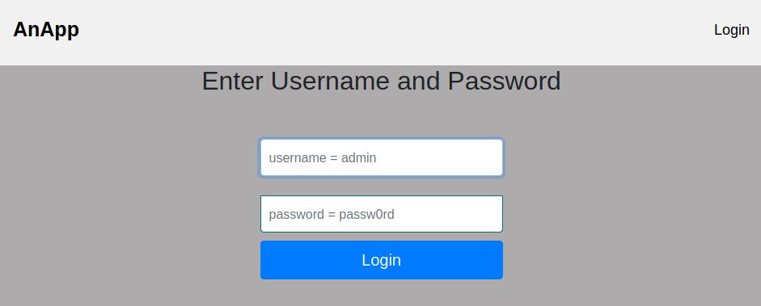
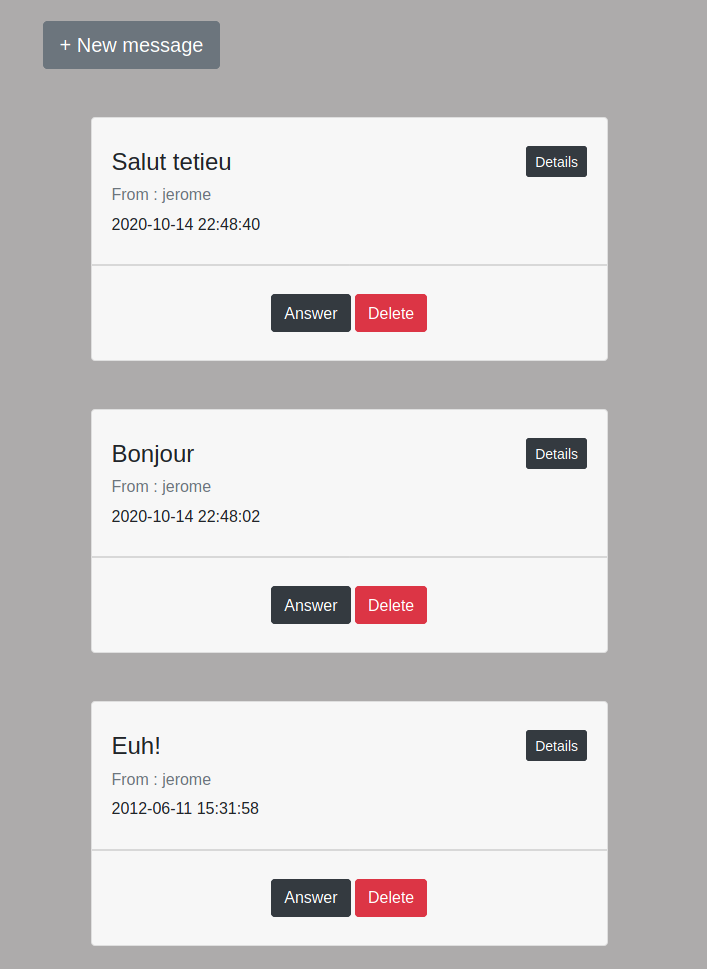
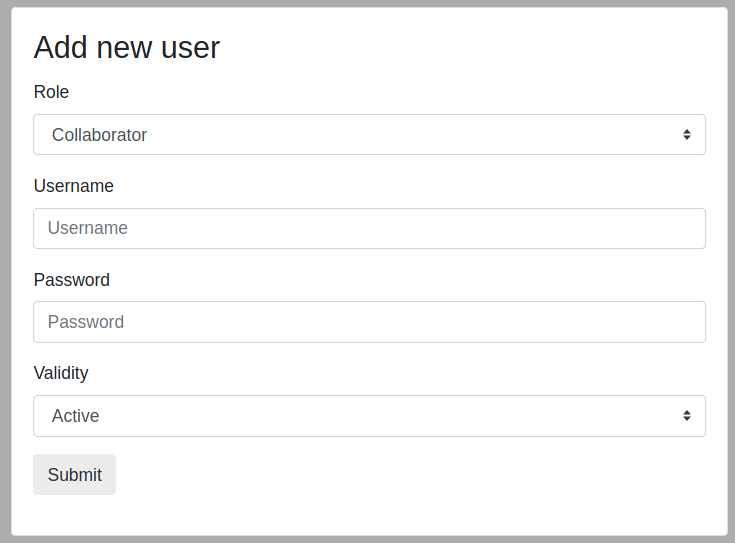
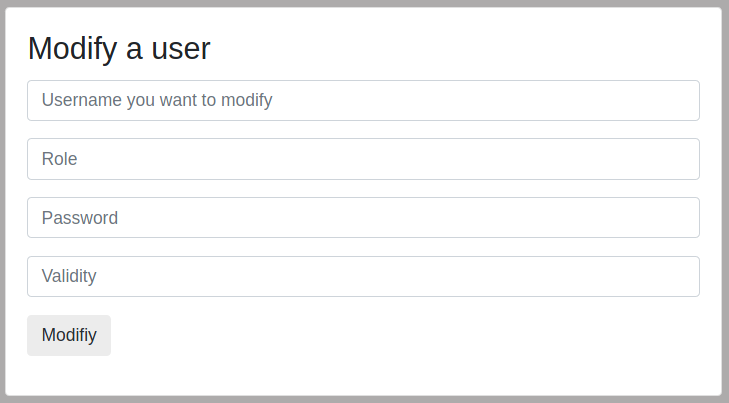

## Guide d'utilisation

**Auteurs:** Arn Jérôme, Barros Henriques Chris

### Lancement de l'application. 
1. Pour commencer, exécuter le script run.sh. ce dernier va lancer container docker et initialiser la base de donnée 
2. ouvrez votre navigateur préféré et allez sur la page http://localhost:8080/login.php

> utilisateurs existants:
> - admin:passw0rd 
> - prof:password
> - assistant:password

### Page de login

En lançant le Docker, on arrive sur cette page de login:

On ne peut accéder à aucune fonctionnalité tant que l'on n'est pas connecté. Si on entre des identifiants erronés, il va s'en dire que la connexion est refusée.

Lorsque la connexion est faite, on arrive sur la page des messages, i.e. la boîte de réception. Si un utlisateur est un simple collaborateur, la barre de navigation du haut change et lui donne accès aux pages "Change password" et à un bouton de déconnexion.

Si celui-ci a le rôle d'admin, il obtient l'accès à la page "Admin".

### Onglet Message

Lorsque l'on clique sur l'onglet Message, on arrive sur cette page où la ligne de tous les messages reçus par ordre décroissant. Chaque message a respectivement un titre, l'expéditeur ainsi que la date de réception. On a aussi trois boutons associés dont le rôle va être expliqué.

On voit finalement qu'il est possible de simplement cliquer sur "New Message" afin d'envoyer un nouveau message.

#### Bouton "Details"

Ce bouton sert simplement à afficher le corps du message reçu. En recliquant une nouvelle fois dessus, on recache ce contenu.

#### Bouton "Delete"

Ce bouton sert à supprimer le message de notre boîte de réception. Un message supprimé ne peut plus être retrouvé (alors attention!).

#### Bouton "New Message"

On arrive sur cette page qui permet simplement d'envoyer un message. Afin d'envoyer un message, il faut au moins renseigner le titre ainsi que le contact à qui l'envoyer. Il est donc possible d'envoyer un message vide.

Il n'est pas possible d'envoyer un message à un utilisateur qui n'existe pas, sinon quoi, un message d'erreur apparaît et annule l'envoi.

#### Bouton "Answer"

Ce bouton permet de se diriger vers la page de rédaction d'un message mais 

avec les champs de titre et de destinataire déjà renseignés afin de directement répondre à l'utilisateur qui nous a écrit. 

### Onglet "Change password"

Cette page sert simplement à modifier notre mot de passe utilisateur.

Si on entre deux mots de passe différents, un message d'erreur apparaît.

### Onglet "Admin"
Cette partie n'est accessible que si un utilisateur a le rôle d'admin. Lorsque l'on arrive sur la page, on a différentes section:

La list de tous les utlisateurs présents dans la base de données. C'est par ce biais qu'on peut vérifier qu'une insertion ou suppression d'un utilisateur a bien été exécutée. 

Un formulaire pour ajouter un nouveau collaborateur en choisissant son rôle, son nom d'utilisateur, son mot de passe, ainsi que si son compte est actif :

Si on entre un nom d'utilisateur déjà utilisé, un message d'erreur l'indiquant apparaît.

Il est aussi possible de modifier les informations d'un utilisateur (sauf son nom):

Finalement, il est possible de supprimer un utilisateur:

