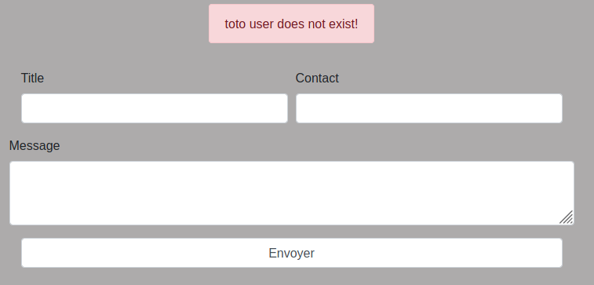
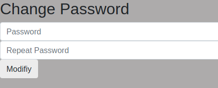

## Guide d'utilisation

### Onglet Message

Lorsque l'on clique sur l'onglet Message, on arrive sur cette page où la ligne de tous les messages reçus par ordre décroissant. Chaque message a respectivement un titre, l'expéditeur ainsi que la date de réception. On a aussi trois boutons associés dont le rôle va être expliqué.

On voit finalement qu'il est possible de simplement cliquer sur "New Message" afin d'envoyer un nouveau message.

#### Bouton "Details"

Ce bouton sert simplement à afficher le corps du message reçu. En recliquant une nouvelle fois dessus, on recache ce contenu.

#### Bouton "Delete"

Ce bouton sert à supprimer le message de notre boîte de réception. Un message supprimé ne peut plus être retrouvé (alors attention!).

#### Bouton "New Message"

On arrive sur cette page qui permet simplement d'envoyer un message. Afin d'envoyer un message, il faut au moins renseigner le titre ainsi que le contact à qui l'envoyer. Il est donc possible d'envoyer un message vide.

Il n'est pas possible d'envoyer un message à un utilisateur qui n'existe pas, sinon quoi, un message d'erreur apparaît et annule l'envoi.

#### Bouton "Answer"

Ce bouton permet de se diriger vers la page de rédaction d'un message mais 

avec les champs de titre et de destinataire déjà renseignés afin de directement répondre à l'utilisateur qui nous a écrit. 

### Onglet "Change password"

Cette page sert simplement à modifier notre mot de passe utilisateur.

Si on entre deux mots de passe différents, un message d'erreur apparaît.